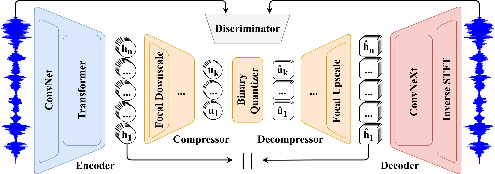

# FocalCodec


A low-bitrate single-codebook 16 kHz speech codec based on [focal modulation](https://arxiv.org/abs/2203.11926).

- **Preprint**: https://arxiv.org/abs/2502.04465

- **Project Page**: https://lucadellalib.github.io/focalcodec-web/

- **Hugging Face Hub**: https://huggingface.co/lucadellalib/focalcodec



---------------------------------------------------------------------------------------------------------

## 🛠️️ Installation

First of all, install [Python 3.8 or later](https://www.python.org). Then, open a terminal and run:

```
pip install huggingface-hub safetensors soundfile torch torchaudio
```

---------------------------------------------------------------------------------------------------------

## ▶️ Quickstart

📌 **NOTE**: the `audio-samples` directory contains downloadable audio samples that you can use to test the codec.

You can easily load the model using `torch.hub` without cloning the repository:

```python
import torch
import torchaudio

# Load FocalCodec model (see available configurations at https://huggingface.co/lucadellalib/focalcodec)
config = "lucadellalib/focalcodec/LibriTTS960_50Hz"
codec = torch.hub.load("lucadellalib/focalcodec", "focalcodec", config=config)
codec.eval().requires_grad_(False)

# Load and preprocess the input audio
audio_file = "audio-samples/librispeech-dev-clean/251-118436-0003.wav"
sig, sample_rate = torchaudio.load(audio_file)
sig = torchaudio.functional.resample(sig, sample_rate, codec.sample_rate)

# Encode audio into tokens
toks = codec.sig_to_toks(sig)  # Shape: (batch, time)
print(toks.shape)
print(toks)

# Convert tokens to their corresponding binary spherical codes
codes = codec.toks_to_codes(toks)  # Shape: (batch, time, log2 codebook_size)
print(codes.shape)
print(codes)

# Decode tokens back into a waveform
rec_sig = codec.toks_to_sig(toks)

# Save the reconstructed audio
rec_sig = torchaudio.functional.resample(rec_sig, codec.sample_rate, sample_rate)
torchaudio.save("reconstruction.wav", rec_sig, sample_rate)
```

Alternatively, you can install FocalCodec as a standard Python package using `pip`:

```bash
pip install focalcodec@git+https://github.com/lucadellalib/focalcodec.git@main#egg=focalcodec
```

Once installed, you can import it in your scripts:

```python
import focalcodec

config = "lucadellalib/focalcodec/LibriTTS960_50Hz"
codec = focalcodec.FocalCodec.from_pretrained(config)
```

Check the code documentation for more details on model usage and available configurations.

---------------------------------------------------------------------------------------------------------

## 🎤 Running the Demo Script

Clone or download and extract the repository, navigate to `<path-to-repository>`, open a terminal and run:

**Speech Resynthesis**

```bash
python demo.py \
--input_file audio-samples/librispeech-dev-clean/251-118436-0003.wav \
--output_file reconstruction.wav
```

**Voice Conversion**

```bash
python demo.py \
--input_file audio-samples/librispeech-dev-clean/251-118436-0003.wav \
--output_file reconstruction.wav \
--reference_files audio-samples/librispeech-dev-clean/84
```

---------------------------------------------------------------------------------------------------------

## @ Citing

```
@article{dellalibera2025focalcodec,
    title   = {{FocalCodec}: Low-Bitrate Speech Coding via Focal Modulation Networks},
    author  = {Luca {Della Libera} and Francesco Paissan and Cem Subakan and Mirco Ravanelli},
    journal = {arXiv preprint arXiv:2502.04465},
    year    = {2025},
}
```

---------------------------------------------------------------------------------------------------------

## 📧 Contact

[luca.dellalib@gmail.com](mailto:luca.dellalib@gmail.com)

---------------------------------------------------------------------------------------------------------
